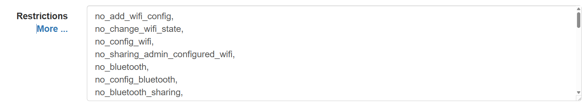

    
  

    <h1>Headwind MDM Configuration</h1>
    
Sistema de gestión de dispositivos móviles

  

 

## 🔗 Links

 

| Type                  | Purpose                                                                 | Payload                                      |
|-----------------------|-------------------------------------------------------------------------|----------------------------------------------|
| configUpdated         | Notify the device about the configuration update                       | none                                         |
| runApp                | Start an application                                                   | `{pkg: "app.package.id"}`                   |
| uninstallApp          | Uninstall an application                                               | `{pkg: "app.package.id"}`                   |
| deleteFile            | Delete a file (the path is relative to the external storage)           | `{path: "/path/to/file"}`                   |
| deleteDir             | Delete a directory recursively                                         | `{path: "/path/to/dir"}`                    |
| purgeDir              | Delete all files in the directory (optionally delete subdirectories)   | `{path: "/path/to/dir", recursive: "1"}`    |
| permissiveMode        | Turn on permissive mode (do not block anything)                        | none                                         |
| reboot                | Reboot a device                                                        | none                                         |
| custom                | Specify a custom type and payload (for testing third-party apps)       | Application-specified                       |
| exitKiosk             | Turn off kiosk mode on a device                                        | none                                         |
| clearDownloadHistory  | Clear download history (when apps fail to download on mobile networks) | none 

> [!NOTE]
> Uso de UserManager.
> Se utiliza para hacer resticciones a diferentes funciones en el dispositivo cliente

`<link>` : <https://github.com](https://developer.android.com/reference/android/os/UserManager)>

| UserManager Constant                     | Valor String                      | Descripción |
|------------------------------------------|-----------------------------------|-------------|
| **Restricciones de red** |
| DISALLOW_CONFIG_WIFI                     | "no_config_wifi"                  | Bloquear configuración WiFi |
| DISALLOW_ADD_WIFI_CONFIG                 | "no_add_wifi_config"              | Evitar agregar redes WiFi |
| DISALLOW_CHANGE_WIFI_STATE               | "no_change_wifi_state"            | Bloquear activar/desactivar WiFi |
| DISALLOW_SHARING_ADMIN_CONFIGURED_WIFI   | "no_sharing_admin_configured_wifi"| Evitar compartir WiFi admin |
| DISALLOW_CONFIG_BLUETOOTH                | "no_config_bluetooth"             | Bloquear configuración Bluetooth |
| DISALLOW_BLUETOOTH                       | "no_bluetooth"                    | Desactivar Bluetooth completamente |
| DISALLOW_BLUETOOTH_SHARING               | "no_bluetooth_sharing"            | Evitar compartir por Bluetooth |
| DISALLOW_CONFIG_MOBILE_NETWORKS          | "no_config_mobile_networks"       | Bloquear configuración redes móviles |
| DISALLOW_CONFIG_TETHERING                | "no_config_tethering"             | Bloquear anclaje a red (tethering) |
| DISALLOW_CONFIG_VPN                      | "no_config_vpn"                   | Bloquear configuración VPN |
| DISALLOW_AIRPLANE_MODE                   | "no_airplane_mode"                | Evitar modo avión |
| DISALLOW_DATA_ROAMING                    | "no_data_roaming"                 | Desactivar roaming datos |
| DISALLOW_NETWORK_RESET                   | "no_network_reset"                | Bloquear reset de red |
| DISALLOW_THREAD_NETWORK                  | "no_thread_network"               | Restringir redes Thread (IoT) |
| **Restricciones de sistema** |
| DISALLOW_SAFE_BOOT                       | "no_safe_boot"                    | Bloquear arranque seguro |
| DISALLOW_FACTORY_RESET                   | "no_factory_reset"                | Bloquear reset de fábrica |
| DISALLOW_SYSTEM_ERROR_DIALOGS            | "no_system_error_dialogs"         | Ocultar diálogos de error |
| DISALLOW_DEBUGGING_FEATURES              | "no_debugging_features"           | Desactivar opciones depuración |
| DISALLOW_GRANT_ADMIN                     | "no_grant_admin"                  | Evitar conceder privilegios admin |
| **Restricciones de apps** |
| DISALLOW_INSTALL_APPS                    | "no_install_apps"                 | Bloquear instalación apps |
| DISALLOW_UNINSTALL_APPS                  | "no_uninstall_apps"               | Bloquear desinstalación apps |
| DISALLOW_INSTALL_UNKNOWN_SOURCES         | "no_install_unknown_sources"      | Bloquear orígenes desconocidos |
| DISALLOW_INSTALL_UNKNOWN_SOURCES_GLOBALLY| "no_install_unknown_sources_globally" | Versión global de la restricción |
| DISALLOW_CONFIG_DEFAULT_APPS             | "disallow_config_default_apps"    | Bloquear cambio apps predeterminadas |
| ENSURE_VERIFY_APPS                       | "ensure_verify_apps"              | Forzar verificación apps |
| DELEGATION_BLOCK_UNINSTALL               | "delegation-block-uninstall"      | Bloquear desinstalación delegada |
| **Restricciones de contenido** |
| DISALLOW_SET_WALLPAPER                   | "no_set_wallpaper"                | Bloquear cambio fondo pantalla |
| DISALLOW_ASSIST_CONTENT                  | "no_assist_content"               | Restringir contenido asistentes |
| DISALLOW_PHYSICAL_MEDIA                  | "no_physical_media"               | Bloquear medios físicos (USB/SD) |
| **Restricciones de perfiles** |
| DISALLOW_MODIFY_ACCOUNTS                 | "no_modify_accounts"              | Bloquear modificación cuentas |
| DISALLOW_REMOVE_MANAGED_PROFILE          | "no_remove_managed_profile"       | Evitar eliminar perfiles gestionados |
| DISALLOW_ADD_MANAGED_PROFILE             | "no_add_managed_profile"          | Bloquear nuevos perfiles gestionados |
| DISALLOW_SHARING_INTO_PROFILE            | "no_sharing_into_profile"         | Restringir compartir a perfil | 
| DISALLOW_SIM_GLOBALLY                    | "no_sim_globally"                 | Desactivar funciones SIM |

## Authors

- [@Plateran](https://www.farmared.com.uy)

